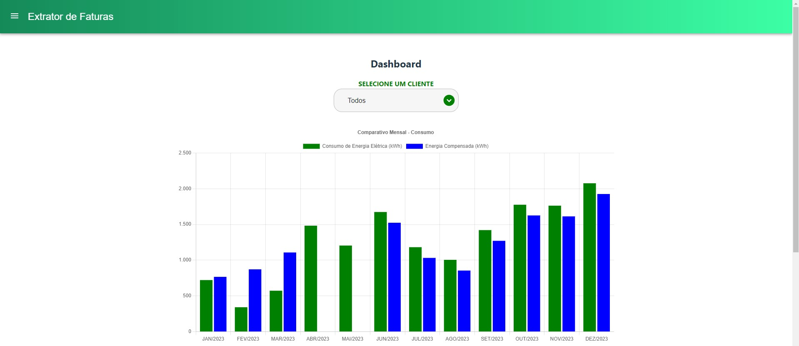
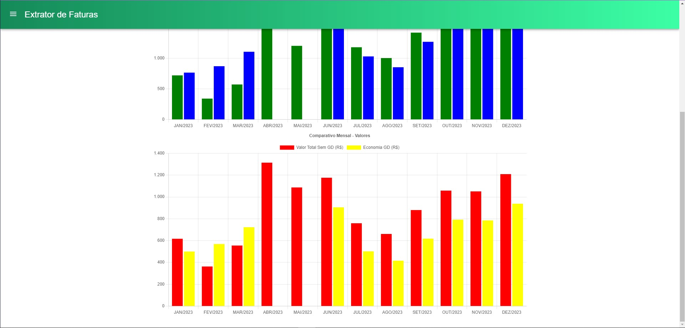
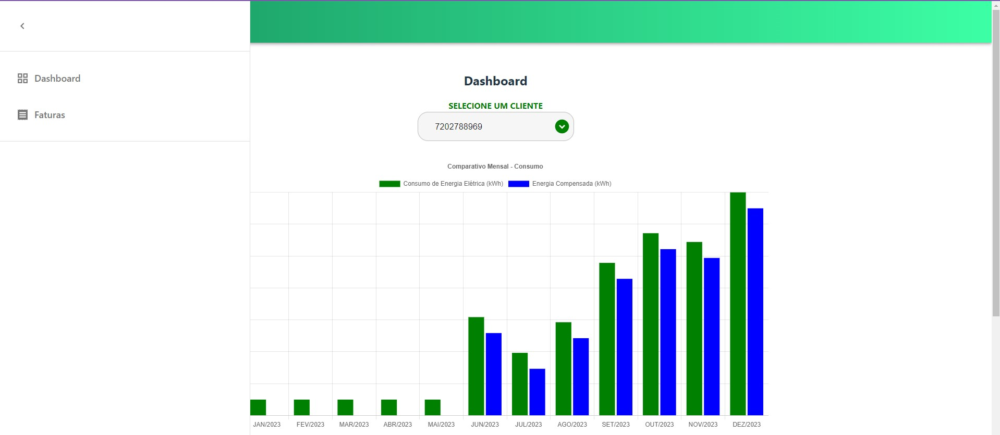
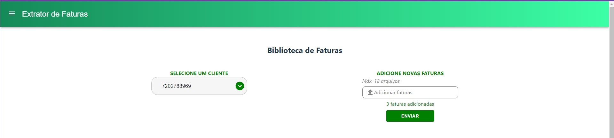
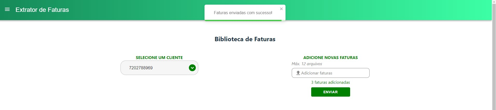
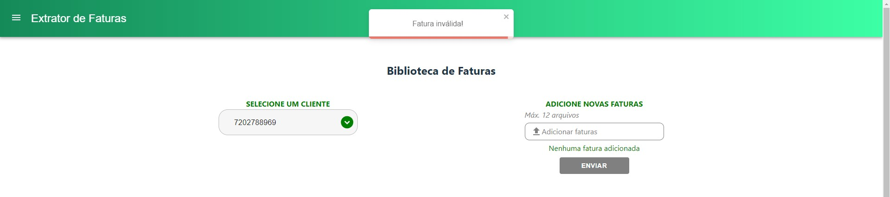
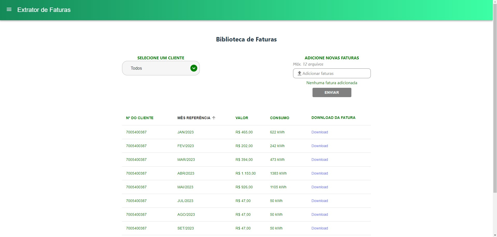
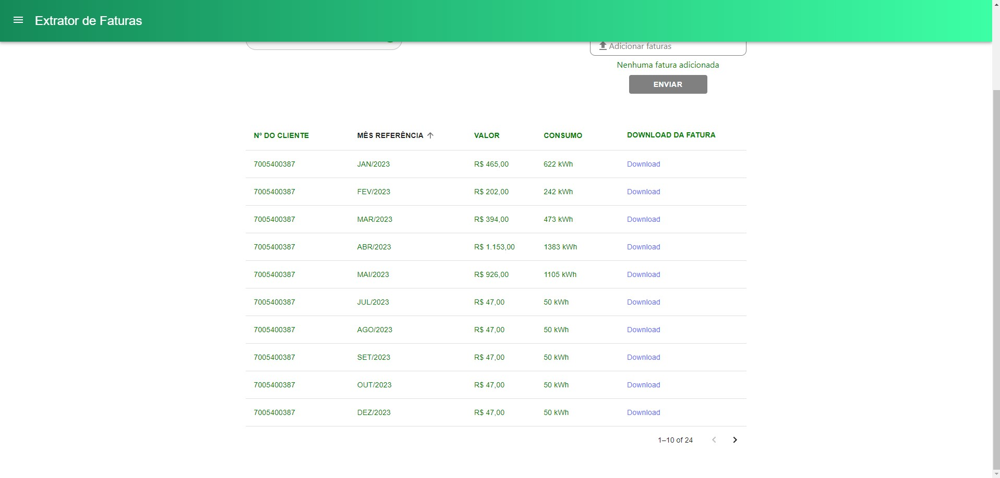

# Desafio Lumi

O projeto está disponível no [Netlify](https://lumi-challenge.netlify.app/).

## Instalação
##### OBS: todos os comandos são considerando a pasta root (lumi-challenge) como inicial.

O projeto está divido entre a **API e frontend**, então serão necessárias duas instalações, uma dentro da pasta API:

    $ cd API
    $ npm install

E outra no **front**:

    $ cd Frontend
    $ npm install

## Rodando o projeto

Novamente, como o projeto está dividido em duas partes, primeiro iniciamos o **backend**:

    $ cd API
    $ npm start

E depois no **front**:

    $ cd Frontend
    $ npm start

A aplicação tem 2 páginas, o Dashboard e a Biblioteca de faturas.

A página inicial é a do Dashboard, onde podemos ver os gráficos solicitados no teste, juntamente com o filtro de usuário. É possível escolher os dados de um cliente em específico, ou, escolhendo a opção 'Todos', podemos ver o somatório de consumo/valores de todos os clientes.

Primeiro os dados de consumo em kWh:

E depois os valores, em R$:

Para navegar para a página de biblioteca de faturas, utilizamos o menu lateral:

Na tela de biblioteca de faturas temos duas funcionalidades. A primeira é o filtro por cliente, com a opção de ver todas as faturas de todos os clientes.
E a segunda funcionalidade é a de adicionar novas faturas da CEMIG, sendo possível enviar até 12 faturas por vez.

Caso o usuário tente fazer o upload de uma fatura que não seja da CEMIG, o seguinte erro aparecerá na tela:

A tabela conta com a opção de ordenar em todas as colunas e também um link para o download da fatura do mês:

A tabela também é paginada para evitar longos tempos de carregamento:

## Rotas

Informações mais detalhadas das rotas no [swagger](https://petstore.swagger.io/?url=https://raw.githubusercontent.com/dutomazoni/desafio-emprestimo/master/API/Routes/swagger.yaml).

## Testes das rotas

Para realizar os testes das rotas, basta entrar na pasta API e rodar o seguinte script:

    $ cd API
    $ npm start-and-test
